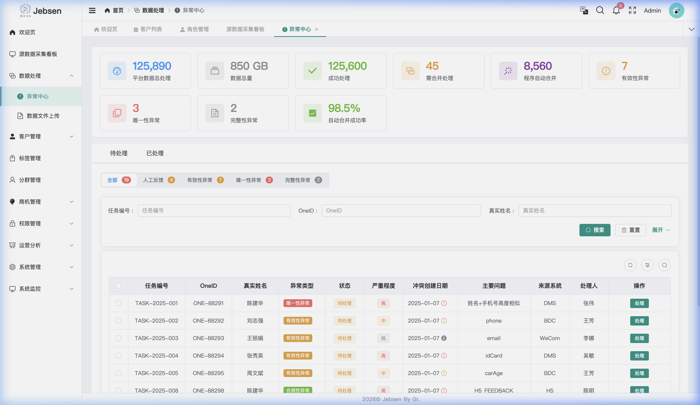
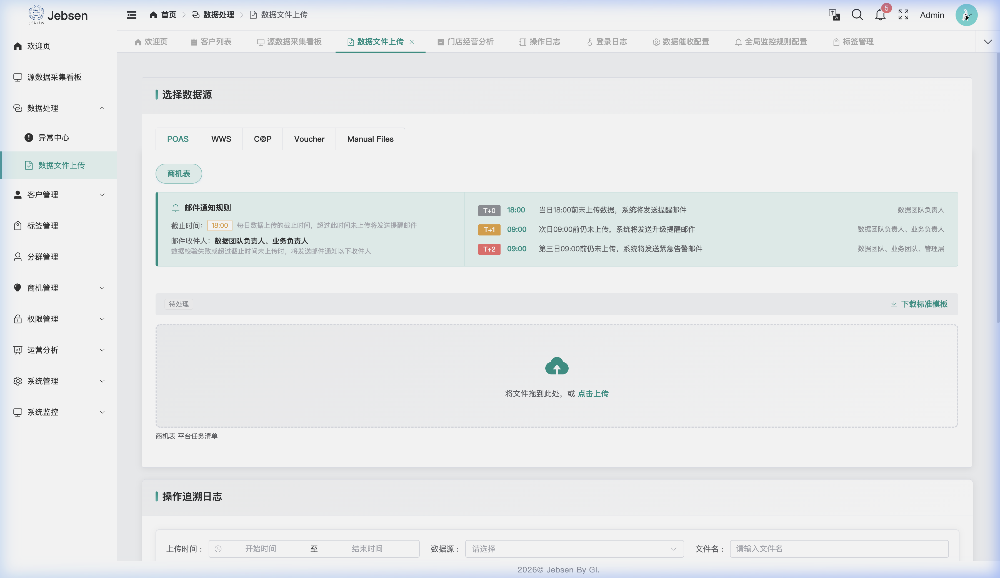
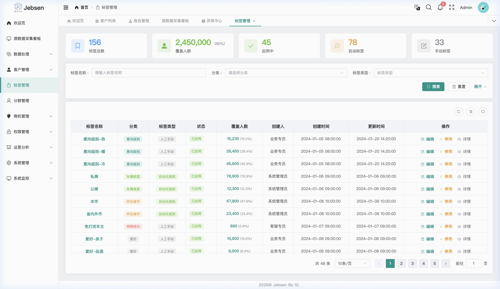
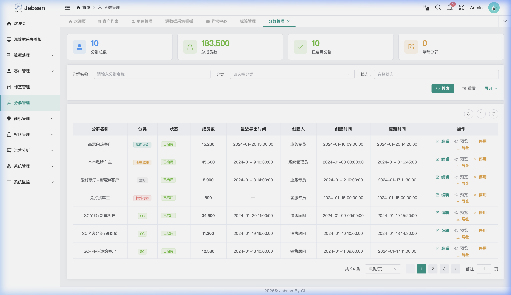
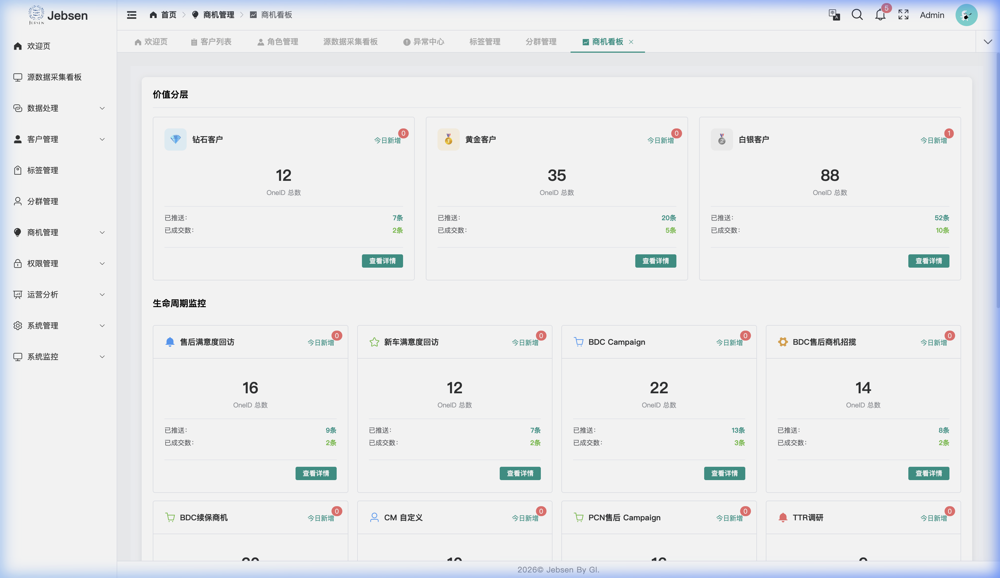

# Jebsen Customer360 产品功能文档

## 1. 产品概述
Jebsen Customer360 是一个全渠道客户洞察与管理平台，旨在通过整合多源数据（DMS, BDC, WeChat, H5 等），构建统一的客户画像 (OneID)，实现数据的标准化、高质量治理及业务闭环。平台分为 **PC 端（管理后台）** 和 **H5 端（一线业务端）**。

### 1.1 业务背景与产品定位
随着业务增长，客户数据分布在 DMS、BDC、WeChat、Voucher 等多个孤岛系统中，存在身份重合、信息碎片化、数据质量不一的问题。Customer360 (C360) 定位于：
- **数据整合枢纽**：整合 7 个核心源系统数据，进行清洗与标准化，而不替代源系统的录入功能。
- **顾客主数据中心**：统一 OneID 编码生成，替代原有分散的标签体系。
- **业务辅助工具**：赋能一线销售与后端管理，支撑自动化商机挖掘与 360° 全景画像展示。

---

## 2. 业务流程与架构
### 2.1 数据处理链路
1. **源数据采集**：实时/定时接入 DMS、BDC、Voucher、WeCom、POAS、WWS、C@P 及人工台账数据。
2. **数据清理与脱敏**：基于 PII 合规要求，对敏感字段进行加密存储与前端展示脱敏。
3. **OneID 身份识别**：基于姓名、电话、地址等多维权重进行自动化聚类。
4. **异常干预**：处理自动识别失败的冲突数据（如同一手机号对应多位真实客户）。
5. **画像聚合与分发**：生成 360° 画像并分发商机至 BDC 系统。

### 2.2 OneID 核心匹配逻辑
系统通过“聚类算法 + 权重判定”实现身份统一：
- **权重因子**：电话 (50%) + 姓名 (30%) + 地址-省市区 (5%) + 街道门牌 (5%) + 楼栋号 (10%)。
- **匹配规则**：
    - 精确匹配：WeCom EID 或 BPID 直接关联。
    - 模糊匹配：手机号重叠位 ≥ 9 位且姓名/地址得分超过阈值。
- **身份血缘**：系统保留所有源记录的演变过程，支持人工手动合并或拆分。

---

## 3. PC 端功能模块 (Backend Administration)

### 3.1 登录与权限入口 (SSO Login)
系统采用 SSO (Single Sign-On) 登录，接入企业域账号，确保访问安全性。

*图 1: PC 端 SSO 登录界面*

### 3.2 欢迎页与核心工作台 (Welcome Page)
系统首页作为运营人员的“驾驶舱”，集中展示数据资产概况与待办任务。
- **数据指标 (Read)**：累计 OneID 总数、本月新增 OneID、异常待处理总数等核心指标。
- **采集看板**：实时显示 DMS、BDC、POAS、WeChat 等源系统的接口同步状态（正常/延迟）。
- **我的任务**：聚合当前登录用户的异常数据纠错任务与商机处理进度。

*图 2: 系统工作台核心指标看板*

### 3.3 数据质量与采集监控 (Data Lifecycle Management)

#### 3.3.1 源数据看板 (Data Source Monitor)
全链路监控数据批处理进度，提供 T+1 任务状态反馈及系统源数据同步看板（DMS, BDC, CRM, Voucher）。

*图 3: 源数据同步与实时监控看板*

#### 3.3.2 异常中心 (Error Correction)
处理自动治理引擎标记的异常。支持：
- **查阅 (Read)**：在待办任务列表点击“处理”，查看原始反馈、系统记录及“智能建议”。
- **更新 (Update)**：
    - **字段修改**：更新姓名、手机、职位、公司等核心 PII。
    - **智能纠错**：点击建议值自动回填，并录入“核实记录”。
- **闭环 (Submit/Ignore)**：点击“保存”应用变更，或“忽略”关闭任务。

*图 4: 异常数据处理中心与智能纠错工作流*

#### 3.3.3 数据文件上传 (Master Data Management)
针对无法通过接口自动同步的台账数据（如 POAS 历史件、WWS 表单、手工 Campaign 记录等），提供手动补录通道：
- **手动上传 (Create)**：支持 .xlsx/csv 格式。用户选择“数据来源”后，可拖拽文件进入上传区域。
- **纠错反馈**：系统实时校验文件格式与字段合法性，对重复记录或格式错误给出即时报错提示。
- **配置规则 (Update)**：在此模块可维护“邮件通知规则”，当数据采集失败或文件处理异常时，自动通知对应负责人。

*图 5: 手工数据上传与 MDM 规则维护*

### 3.4 客户洞察与治理 (Customer Insight)
#### 3.4.1 客户全景列表
提供多维聚合视图，支持以下操作：
- **详情查阅 (Read)**：点击“360 视图”唤起侧滑窗，涵盖 **数据同步监控、联系人档案、订单分析、交互记录、身份血缘** 等 9 大板块。
- **核心编辑 (Update)**：在侧滑窗点击“编辑基本信息”，支持手动维护：
    - 公司名称、生命周期状态（激活/停用/冲突）。
    - 办公地址、多渠道电话标签维护。
- **只读说明**：OneID 下的底层交易记录（DMS 订单等）为只读，确保源头数据一致。

*图 6: 客户列表与侧滑 360 视图 CRUD 交互*

#### 3.4.2 标签管理 (Tag Management)
实现客户特征的精细化定义与全生命周期管理：
- **创建 (Create)**：
    - **手动打标**：进入“客户筛选”，通过属性组合定位客群，批量点击“应用标签”。
    - **系统注入**：由 OneID 治理引擎基于源数据（如车系、城市、进店频率）自动化打标。
- **查阅 (Read)**：点击“详情”查看标签 ID、分类、全量覆盖 OneID 统计及版本变更历史。
- **更新 (Update)**：支持修改标识名称、分类及业务描述；通过“状态开关”控制标签在前端的展示。
- **删除 (Delete)**：采用逻辑删除机制。将标签标记为“已停用”或“已废弃”，系统即停止该维度的数据计算。

*图 7: 标签管理系统与 CRUD 工作流*

#### 3.4.3 分群管理 (Segment Management)
基于可视化规则引擎，构建动态更新的精准客群池：
- **创建 (Create)**：
    - **工作流**：客户筛选 -> 设定漏斗/自定义规则 -> 点击“保存为分群”。
    - **逻辑引擎**：支持可视化“且/或 (And/Or)”逻辑嵌套，通过多组过滤条件实现交、并、差运算。
- **查阅 (Read)**：通过“预览”查看分群实时命中人数及采样明细。
- **更新 (Update)**：点击“编辑”即刻调整筛选逻辑，系统将重新计算并刷新分群成员。
- **删除 (Delete)**：点击“停用”使该分群进入静默状态，停止动态计算。

*图 8: 客户分群可视化规则配置引擎*

### 3.5 营运与触达 (Operation & Engagement)

#### 3.5.1 自动化商机引擎
系统预设 8 大标准商机模型，支持下述管理流：
- **规则配置 (Update)**：点击“编辑”修改商机名称、描述、关联标签及目标客群。
- **分发控制**：设定优先级（高/中/低）、推送目的地（BDC 外呼系统）及有效期。
- **启停开关 (Deactivate)**：不提供物理物理删除，通过“启用状态”开关控制规则是否生效。

*图 9: 商机转化分层看板*

*图 10: 商机分发规则配置与状态控制*

### 3.6 运营分析 (Operation Analysis)
为管理层提供多门店、多维度的经营分析报表。
- **业务看板 (Read)**：监控各门店的“线索转化率”、“客户留存率”及“市场渗透率”。
- **深度穿透**：点击特定门店指标，可下钻查看具体商机转化路径与流失环节。

*图 11: 门店经营分析大屏*

### 3.7 系统管理与监控 (System Administration)
基于 RBAC (Role-Based Access Control) 的精细化权限配置。

#### 3.7.1 角色管理

*图 12: RBAC 角色权限配置*

#### 3.7.2 操作日志审计 (Audit Logs)
记录所有用户的增删改操作，确保数据治理过程可溯源。
- **审计内容 (Read)**：包括操作时间、模块名称、操作人、原值及变更后值。

*图 13: 系统操作日志审计界面*

#### 3.7.3 全局监控规则配置 (Monitoring Rules)
设定系统级的自动化健康指标。
- **规则配置 (Update)**：配置“源数据缺失阈值”、“治理任务积压预警”等全局参数。

*图 14: 全局监控与质量预警规则配置*

---

## 4. H5 端功能模块 (Mobile Interface)

### 4.1 客户画像 (360 View)
H5 端为一线人员提供全方位的客户画像：
- **基本信息**：汇总 OneID 下的所有个人属性。
- **联系电话**：展示合并后的唯一号码及来源系统的原始号码。
- **车辆信息**：汇总名下所有车辆及维保情况。

*图 15: H5 客户画像主视角*

### 4.2 核心深度交互
#### 4.2.1 身份切换与 OneID 关联
当系统中存在多个疑似同一人的 OneID 时，一线人员可以查看关联风险并进行手动切换或核对。

*图 16: 身份选择 ActionSheet*

#### 4.2.2 电话管理 (Phone & Label Management)
此模块支持多维度联系方式维护：
- **新增号码 (Create)**：点击“查看所有电话”->“新增号码”，录入手机号、关联人（如配偶、本人）、业务标签及备注。
- **编辑标签 (Update)**：点击号码旁的 **铅笔图标 (✏️)**，修改号码主体（Owner/Driver）、业务属性（Main Number）及标签。
- **物理删除 (Delete)**：点击非主号旁的 **垃圾桶图标 (🗑️)** 即可剔除冗余号码，系统自动保留至少一个主号。

*图 17: H5 电话管理 CRUD 交互界面*

#### 4.2.3 冲突处理 (Conflict Resolver)
当系统检测到不同来源的 PII 数据冲突时（如姓名、手机），H5 端提供“冲突通知栏”。
- **确认逻辑**：一线人员可现场核实并选择“保留现有”、“采用新值”或“手动修正”，操作结果实时同步 OneID 映射表。

*图 18: H5 冲突合并工作流与多源比对*

#### 4.2.4 公司画像 (Enterprise Portrait)
针对 B2B 场景，提供“企业全景画像”：
- **查阅 (Read)**：查看 OneID、行业、所属门店及大客户等级。
- **权益追踪**：实时展示企业大客户礼包余额（如 ¥50,000.00）及过期时间。
- **标签维护 (Update)**：点击标签区的“管理”，为主体公司手动 **增加或移除** 业务标签（如 VIP 企业、重点潜客）。

*图 19: 企业客户全景视角与 CRUD 交互看板*

---

## 5. 业务场景举例

### 场景一：销售接待与身份确认
**背景**：客户 A 来店。销售输入手机号搜索。
**过程**：
1. 系统发现客户 A 在 DMS 中有购车记录，但在 WeChat 中有活动参与记录，且两个系统登记的姓名微差（A vs A*）。
2. H5 端触发“冲突处理”，销售在现场向客户确认后，选择保留 DMS 中的正式姓名。
3. 更新后的画像同步至全局，后续 BDC 回访见到的即为核实后的正确姓名。

### 场景二：自动化标签精准营销
**背景**：运营需要在“捷成生日月”推送活动给特定车主。
**过程**：
1. PC 端在“标签管理”中设定自动规则：标签 `生日月份-次月` && `近3月有进店维保`。
2. 在“分群管理”中创建名为 `生日进店高活群体`。
3. 系统自动计算出 500 名符合要求的 OneID。
4. “商机管理”自动化分发 BDC 规则，将外呼任务推送至对应专员的系统。

---

## 6. 技术规格摘要
### 6.1 架构与部署
- **基础设施**：部署于阿里云（中国境内节点），采用 **数据湖仓 (Lakehouse)** 架构，支持大规模增量数据同步。
- **身份认证**：集成 Azure Entra ID 实现 **SSO (Single Sign-On)**，支持 OAuth + OIDC 协议。

### 6.2 前端与安全
- **技术栈**：Vue 3 + Vite + Ant Design (PC) / Vant (H5)。
- **权限模型**：基于 **RBAC (Role-Based Access Control)** 实现精细化权限配置，支持门店级数据隔离与 PII 字段脱敏。
- **安全审计**：系统 Session 刷新频率 1-4 小时，全量操作日志可审计。
