# Jebsen Customer360 产品功能文档

## 目录

<!-- toc -->

- [1. 产品概述](#1-产品概述)
  * [1.1 业务背景与产品定位](#11-业务背景与产品定位)
- [2. 业务流程与架构](#2-业务流程与架构)
  * [2.1 数据处理链路](#21-数据处理链路)
  * [2.2 OneID 核心匹配逻辑](#22-oneid-核心匹配逻辑)
- [3. PC 端功能模块 (Backend Administration)](#3-pc-端功能模块-backend-administration)
  * [3.1 登录与权限入口 (SSO Login)](#31-登录与权限入口-sso-login)
  * [3.2 欢迎页与核心工作台 (Welcome Page)](#32-欢迎页与核心工作台-welcome-page)
    + [3.2.1 数据资产看板 (Data Assets)](#321-数据资产看板-data-assets)
    + [3.2.2 采集状态监控 (Data Collection Status)](#322-采集状态监控-data-collection-status)
    + [3.2.3 我的任务待办 (My Tasks)](#323-我的任务待办-my-tasks)
    + [3.2.4 清洗成效与导航 (Effectiveness & Navigation)](#324-清洗成效与导航-effectiveness--navigation)
  * [3.3 数据质量与采集监控 (Data Lifecycle Management)](#33-数据质量与采集监控-data-lifecycle-management)
    + [3.3.1 源数据看板 (Data Source Monitor)](#331-源数据看板-data-source-monitor)
    + [3.3.2 异常中心与身份治理 (Error Correction & Lineage)](#332-异常中心与身份治理-error-correction--lineage)
      - [1. 人工反馈 (Manual Feedback)](#1-人工反馈-manual-feedback)
      - [2. 值域合法性 (Validity)](#2-值域合法性-validity)
      - [3. 唯一性冲突 (Uniqueness)](#3-唯一性冲突-uniqueness)
      - [4. 完整性缺失 (Completeness)](#4-完整性缺失-completeness)
    + [3.3.3 数据催收与全局逻辑 (Collection & Global Rules)](#333-数据催收与全局逻辑-collection--global-rules)
  * [3.4 客户洞察与治理 (Customer Insight)](#34-客户洞察与治理-customer-insight)
    + [3.4.1 客户全景列表](#341-客户全景列表)
    + [3.4.2 标签管理 (Tag Management)](#342-标签管理-tag-management)
    + [3.4.3 分群管理 (Segment Management)](#343-分群管理-segment-management)
  * [3.5 营运与触达 (Operation & Engagement)](#35-营运与触达-operation--engagement)
    + [3.5.1 商机引擎 (Lead Engine - Distribution Config)](#351-商机引擎-lead-engine---distribution-config)
    + [3.5.2 触达任务 (Engagement Tasks - Lead Tracking)](#352-触达任务-engagement-tasks---lead-tracking)
  * [3.6 运营分析 (Operation Analysis)](#36-运营分析-operation-analysis)
  * [3.7 系统管理与监控 (System Administration)](#37-系统管理与监控-system-administration)
    + [3.7.1 角色管理](#371-角色管理)
    + [3.7.2 操作日志审计 (Audit Logs)](#372-操作日志审计-audit-logs)
    + [3.7.3 全局监控规则配置 (Monitoring Rules)](#373-全局监控规则配置-monitoring-rules)
- [4. H5 端功能模块 (Mobile Interface)](#4-h5-端功能模块-mobile-interface)
  * [4.1 客户画像 (360 View)](#41-客户画像-360-view)
  * [4.2 核心深度交互](#42-核心深度交互)
    + [4.2.1 身份切换与 OneID 关联](#421-身份切换与-oneid-关联)
    + [4.2.2 电话管理 (Phone & Label Management)](#422-电话管理-phone--label-management)
    + [4.2.3 冲突处理 (Conflict Resolver)](#423-冲突处理-conflict-resolver)
    + [4.2.4 公司画像 (Enterprise Portrait)](#424-公司画像-enterprise-portrait)
- [5. 业务场景举例](#5-业务场景举例)
  * [场景一：销售接待与身份确认](#场景一销售接待与身份确认)
  * [场景二：自动化标签精准营销](#场景二自动化标签精准营销)
- [6. 技术规格摘要](#6-技术规格摘要)
  * [6.1 架构与部署](#61-架构与部署)
  * [6.2 前端与安全](#62-前端与安全)

<!-- tocstop -->

## 1. 产品概述
Jebsen Customer360 是一个全渠道客户洞察与管理平台，旨在通过整合多源数据（DMS, BDC, WeChat, H5 等），构建统一的客户画像 (OneID)，实现数据的标准化、高质量治理及业务闭环。平台分为 **PC 端（管理后台）** 和 **H5 端（一线业务端）**。

### 1.1 业务背景与产品定位
随着业务增长，客户数据分布在 DMS、BDC、WeChat、Voucher 等多个孤岛系统中，存在身份重合、信息碎片化、数据质量不一的问题。Customer360 (C360) 定位于：
- **数据整合枢纽**：整合 7 个核心源系统数据，进行清洗与标准化，而不替代源系统的录入功能。
- **顾客主数据中心**：统一 OneID 编码生成，替代原有分散的标签体系。
- **业务辅助工具**：赋能一线销售与后端管理，支撑自动化商机挖掘与 360° 全景画像展示。

---

## 2. 业务流程与架构
### 2.1 数据处理链路
1. **源数据采集**：实时/定时接入 DMS、BDC、Voucher、WeCom、POAS、WWS、C@P 及人工台账数据。
2. **数据清理与脱敏**：基于 PII 合规要求，对敏感字段进行加密存储与前端展示脱敏。
3. **OneID 身份识别**：基于姓名、电话、地址等多维权重进行自动化聚类。
4. **异常干预**：处理自动识别失败的冲突数据（如同一手机号对应多位真实客户）。
5. **画像聚合与分发**：生成 360° 画像并分发商机至 BDC 系统。

### 2.2 OneID 核心匹配逻辑
系统通过“聚类算法 + 权重判定”实现身份统一：
- **权重因子**：电话 (50%) + 姓名 (30%) + 地址-省市区 (5%) + 街道门牌 (5%) + 楼栋号 (10%)。
- **匹配规则**：
    - 精确匹配：WeCom EID 或 BPID 直接关联。
    - 模糊匹配：手机号重叠位 ≥ 9 位且姓名/地址得分超过阈值。
- **身份血缘**：系统保留所有源记录的演变过程，支持人工手动合并或拆分。

---

## 3. PC 端功能模块 (Backend Administration)

### 3.1 登录与权限入口 (SSO Login)
系统采用 SSO (Single Sign-On) 登录，接入企业域账号，确保访问安全性。

*图 1: PC 端 SSO 登录界面*

### 3.2 欢迎页与核心工作台 (Welcome Page)
系统首页作为运营人员的“驾驶舱”，集中展示数据资产概况、采集监控及实时待办任务。

#### 3.2.1 数据资产看板 (Data Assets)
实时统计平台核心数据概况，支持管理层快速掌握资产总量：
- **全量 OneID**：展示系统已聚合生成的唯一身份总数（如 1.3M+）。
- **月度增量**：本月新接入的客户记录数（如 +1,245）。
- **治理成效**：统计已执行“合并 (Merged)”与“画像更新 (Updated)”的记录比例，体现数据去重与填充效果。

#### 3.2.2 采集状态监控 (Data Collection Status)
提供源系统接口的实时同步健康度检查，并在标题处通过 Badge 提示待处理系统数：
- **状态标识**：
    - **成功/同步 (Success/Synced)**：DMS (Daily CSV)、BDC、Voucher 等系统数据已按计划入库。
    - **等待上传 (Pending Upload)**：针对 POAS、WWS、C@P 等手动台账系统，提供蓝色的“上传”快捷按钮。
- **采集频率**：明确各系统的数据同步频率（T+1 或实时）。

#### 3.2.3 我的任务待办 (My Tasks)
聚合当前登录用户的治理任务流，支持直接点击“处理”跳转至对应模块：
- **合并冲突 (Merge Conflict)**：针对系统评分接近但无法自动识别的身份，提醒人工核对。
- **质量预警 (Data Quality)**：识别手机号格式错误、关键字段缺失等需人工补全的任务。
- **任务概览**：首页顶部横幅实时滚动“X 条治理任务待处理”，确保业务闭环效率。

#### 3.2.4 清洗成效与导航 (Effectiveness & Navigation)
- **成效趋势图**：以 7 天为周期，展示“清洗后异常数据下降”与“标签覆盖率上升”的波动曲线。
- **快捷导航**：提供源数据看板、数据文件上传、异常中心等核心模块的直达入口。
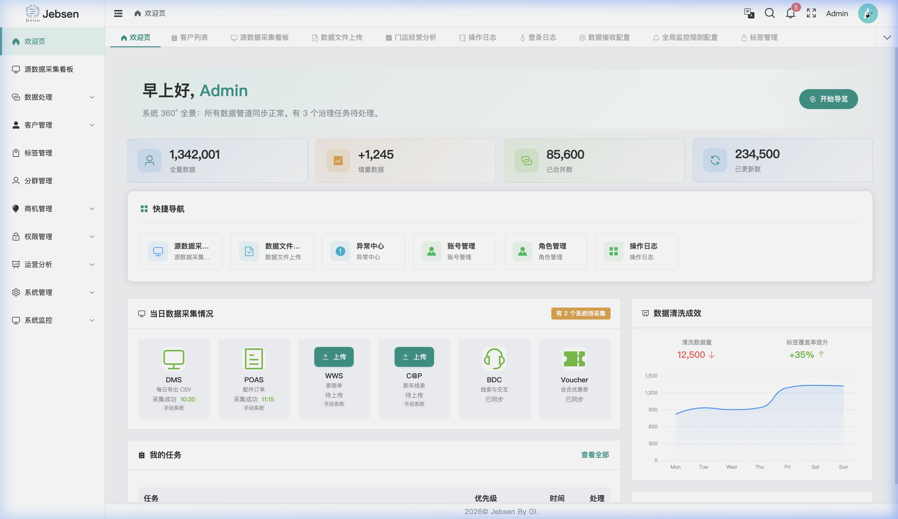
*图 2: 系统工作台核心指标与采集状态看板*

### 3.3 数据质量与采集监控 (Data Lifecycle Management)

#### 3.3.1 源数据看板 (Data Source Monitor)
提供平台级的数据中枢监控，分为实时指标、批处理进度及治理日志三大板块。

- **核心实时指标 (KPIs)**：
    - **当日处理总量**：实时统计全量源记录的处理规模（如 **125.9K**）。
    - **累计数据量**：展示平台已承载的物理数据规模（如 **850 GB**）。
    - **数据清洗率**：核心质量得分（如 **92.5%**），反映了通过准入校验的记录占比。
- **全链路批处理进度 (Batch Pipeline)**：
    可视化展示每日 ETL 任务的 5 大生命周期阶段，并在界面显示实时开始时间与完成度图标：
    1.  **Ingestion (采集)**：监控原始 CSV/API 数据同步完整度。
    2.  **Cleaning (清洗)**：脱敏规则的应用与无效字段过滤。
    3.  **Identify (识别)**：OneID 聚类逻辑执行状态（当前高频更新阶段）。
    4.  **Tagging (打标)**：资产与业务标签的静态/动态计算。
    5.  **Dispatch (分发)**：画像推送到 H5 或第三方 BDC 系统。
- **采集成效分析 (Charts)**：
    - **趋势图表**：支持切换“采集量”与“清洗率”视角，通过 hourly 柱状图展示全天的流量波动与质量健康度。
    - **拦截统计**：实时显示“已拦截异常 (Intercepted)”总数（如 1240 条），便于回溯数据治理前置拦截效果。
- **治理动态总结**：
    看板右侧实时更新 **Pending Conflicts (待处理冲突)**，如：“[王芳] (微信) 与 [王*芳] (DMS) 自动匹配失败”，提醒治理员介入。
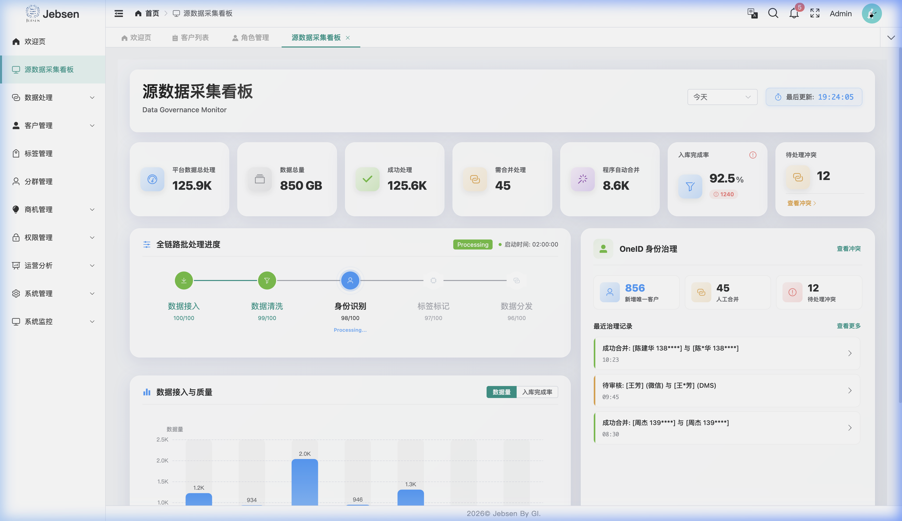
*图 3: 源数据同步进度、质量趋势与全链路 Pipeline 监控看板*

#### 3.3.2 异常中心与身份治理 (Error Correction & Lineage)
自动化治理引擎发现异常后，将其分发至纠错中心，由治理员通过专用的冲突处理工作台完成闭环。

- **异常分类与检索 (Exception List)**：
    - **多维度筛选**：支持按 **Status (待处理/已处理)**、**Severity (高/中/低)** 及 **Exception Type (合法性/唯一性/完备性/人工反馈)** 进行过滤。
- **冲突处理工作台 (Governance Workbench)**：
    采用双栏对比布局，确保治理决策的严谨性：
    - **系统现状 (Current System)**：展示主记录当前的核心 PII 字段，并显式标注每个字段的 **Source System (来源系统)**（如：来源: DMS）。
    - **来源锁定 (Source Locking)**：对于已人工纠错的字段，系统标记为 **Locked (锁定)**，防止后续自动化批处理覆盖人工确认为“事实”的值。
    - **反馈与建议 (Right Panel)**：
        - **智能建议 (Smart Suggestion)**：通过 AI 判定展示“疑似姓名”或“疑似手机”，治理员可点击 **Apply (一键应用)** 图标将建议值快速录入。
        - **核实记录**：强制录入“核实原因”与“备注”，作为审计闭环的依据。
- **治理场景与异常类型 (Exception Type Scenarios)**：
    系统通过内置质量规则，自动将治理任务归纳为四大类，并提供针对性工作台：
    
    ##### 1. 人工反馈 (Manual Feedback)
    处理来自 H5 端一线人员通过核实确认提交的变更请求，通过多源核实确保 PII 信息准确性。
    
    
    *图 4: 人工反馈类型列表与冲突处理工作台*

    ##### 2. 值域合法性 (Validity)
    自动捕获格式错误（如非法手机号）、范围越界或逻辑不一致（如生日晚于首次开仓日）的异常记录。
    
    
    *图 5: 合法性校验失败记录与格式修正工作台*

    ##### 3. 唯一性冲突 (Uniqueness)
    识别系统中的疑似重复 OneID（如姓名/手机高度重合但 ID 不同），支持专家进行跨来源实体的物理合并。
    
    
    *图 6: 重复 OneID 归并建议与多源合并审计视图*

    ##### 4. 完整性缺失 (Completeness)
    针对必填项缺失、关键业务字段空白的情况触发告警，引导治理员通过第三方补录或手动丰富档案。
    
    
    *图 7: 关键信息缺失概览与档案丰富工作台*

- **身份血缘溯源 (Identity Lineage)**：
    工作台内置 **Identity Lineage Trace** 审计表，提供 OneID 演变的透明化链路：
    - **全量审计字段**：包括：**合并时间 (Time)**、**操作人 (Operator)**、**来源系统 (Source)**、**变更字段 (Field)**、**原始值 (Original)**、**新值 (New)** 及 **变更原因 (Reason)**。
    - **合并链路**：清晰展示一个 OneID 是如何从多个原始源（如 DMS、WeCom、H5）逐步聚合为单一身份的全过程。

*图 8: OneID 身份演变全链路血缘溯源审计表*

*图 9: 异常中心综合列表视图*

#### 3.3.3 数据催收与全局逻辑 (Collection & Global Rules)
针对离线台账及全局系统健康度建立监控防线。

- **数据文件补录 (MDM Upload)**：
    支持非自动化系统（如 POAS、WWS、C@P、Voucher、Manual）的补录工作流：
    - **标准模板约束**：治理员必须通过“下载标准模板”获取最新的 schema 定义，确保上传数据的字段映射与业务逻辑 100% 匹配。
    - **操作追溯流水 (Log)**：底部内置“操作记录”表，记录上传时间、数据来源、文件名、操作人及校验结果。

*图 10: MDM 数据上传工作流与标准模板应用*
*图 11: 数据上传历史追溯与执行状态审计*

- **数据催收配置 (Collection Logic)**：
    在此模块中可根据业务需求，为每个源端系统量身定制 T+N 阶梯式预警频率与接收主体：
    - **T+0 (当日 18:00)**：若必传文件缺失，自动触发邮件提醒，发送至 **数据小组负责人**。
    - **T+1 (次日 09:00)**：针对仍未补回的系统，推送“正式预警”至 **数据小组长及业务接口人**。
    - **T+2 (次日 09:00)**：红色严重预警将抄送至 **管理层** 与治理专家，强迫进行补录治理。

*图 12: T+N 阶梯式催收逻辑与邮件路由配置看板*

- **全局监控规则 (Global Rules Config)**：
    治理员可对平台底层监控引擎进行颗粒度配置，确保系统级稳定性：
    - **监控开关 (Toggles)**：支持“源数据更新监控”、“数据质量致命错误检测”及“系统性能负载预警”的独立启停。
    - **抄送路由**：配置每个规则的专属 Email 列表，实现异常告警的精准触达。

*图 13: 全局监控指标看板与告警策略配置*

### 3.4 客户洞察与治理 (Customer Insight)
#### 3.4.1 客户全景列表
提供多维聚合视图，支持以下操作：
- **详情查阅 (Read)**：点击“360 视图”唤起侧滑窗，涵盖 **数据同步监控、联系人档案、订单分析、交互记录、身份血缘** 等 9 大板块。
- **核心编辑 (Update)**：在侧滑窗点击“编辑基本信息”，支持手动维护：
    - 公司名称、生命周期状态（激活/停用/冲突）。
    - 办公地址、多渠道电话标签维护。
- **只读说明**：OneID 下的底层交易记录（DMS 订单等）为只读，确保源头数据一致。
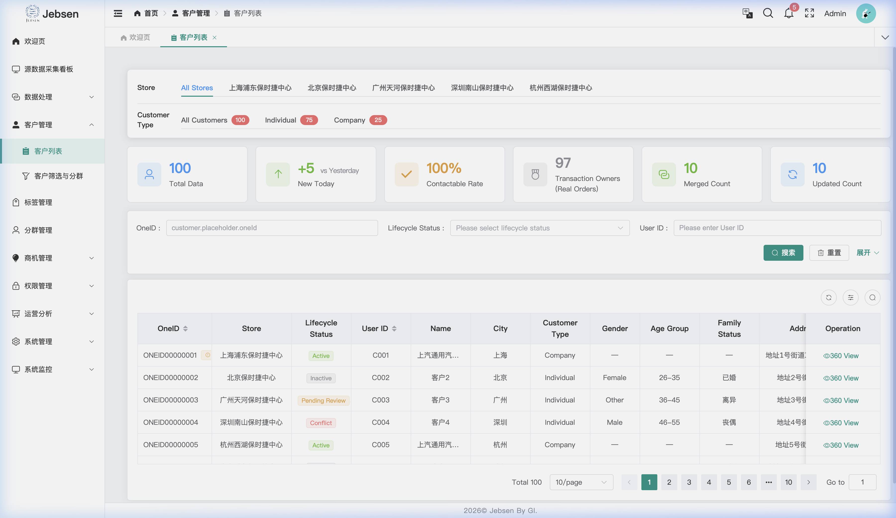
*图 14: 客户列表与侧滑 360 视图 CRUD 交互*

#### 3.4.2 标签管理 (Tag Management)
实现客户特征的精细化定义与全生命周期管理，涵盖从标签定义到看板展示的闭环。

- **全量列表 (Read List)**：
    提供全局标签概览，支持基于“标签类型”、“业务分类”及“更新状态”的快速检索，展示名称、应用来源及覆盖 OneID 总量。

*图 15: 标签管理主界面与全量资产列表*

- **新增配置 (Create)**：
    点击“新增”唤起配置弹窗。支持基础信息维护、业务逻辑映射及规则测试。

*图 16: 手动新增标签配置 (基础属性与逻辑关联)*

- **详情审计 (Read Detail)**：
    点击“详情”通过侧滑抽屉展示标签完整统计，包括版本变更记录与详细的覆盖分析图表。

*图 17: 标签属性详情页 (涵盖版本流水与覆盖统计)*

- **编辑更新 (Update)**：
    支持对现有标签的元数据（名称、分类）及底层计算逻辑进行动态调整。

*图 18: 标签参数动态更新工作台*

- **停用逻辑 (Deactivate - No Delete)**：
    **系统不提供物理删除删除 (Delete) 功能**。通过“停用”操作实现资产逻辑下线。停用后标签将进入静默状态，不再参与实时计算与前端展示，但历史血缘数据予以保留以便审计。

*图 19: 标签逻辑下线 (停用确认) 视图*

#### 3.4.3 分群管理 (Segment Management)
基于可视化规则引擎，构建动态更新的精准客群池，实现从筛选到触达的深度连接。

- **分群列表 (Read List)**：
    提供全量分群资产视图，直观展示分群命中的 OneID 实时总数、昨日新增以及各分群的同步状态。

*图 20: 客户分群主界面与动态模型资产列表*

- **创建分群 (Create)**：
    点击“新增”进入配置页。支持通过人员属性、车辆特征及行为标签进行可视化“且/或”逻辑嵌套，实时预览命中人数。

*图 21: 可视化规则引擎新建分群配置页*

- **分群预览 (Read Detail)**：
    点击“预览”或“详情”查看分群实时命中人数及采样明细，支持下钻至具体 OneID 的 360 画像。

*图 22: 分群实时命中预览与详细属性分析*

- **策略调整 (Update)**：
    支持在线编辑分群规则，保存后系统将自动重新计算并刷新分群成员，实现定向资产的即时响应。

*图 23: 现有分群筛选逻辑动态调整工作台*

- **停用逻辑 (Deactivate - No Delete)**：
    **分群管理同样不支持物理删除 (Delete) 功能**。通过点击“停用”操作实现模型的资产逻辑下线。停用后该分群将停止自动计算且不再作为商机触发源，但规则定义保留在底层以便复用。

*图 24: 客群模型停用 (资产置灰) 确认视图*

### 3.5 营运与触达 (Operation & Engagement)

#### 3.5.1 商机引擎 (Lead Engine - Distribution Config)
自动化捕获高意向客户并分发至一线触达，实现营销闭环。

- **分发列表 (Read List)**：
    全局管理所有商机分发规则，直观监控每条规则的触发频率、关联渠道（BDC/一线）及执行状态。

*图 25: 商机分发分发配置主界面与规则列表*

- **新增配置 (Create)**：
    点击“新增”定义商机触发源（如分群、行为标签）以及分发逻辑，支持设定优先级与任务有效期。

*图 26: 自动化商机引擎规则配置弹窗*

- **编辑与启停 (Update/Deactivate)**：
    支持对分发规则的名称、目标渠道及策略进行在线微调。通过“状态”开关实现规则的即时生效或静默，系统不支持物理删除。

*图 27: 商机规则参数动态调整与启停控制*

#### 3.5.2 触达任务 (Engagement Tasks - Lead Tracking)
商机分发后，系统自动生成触达任务，支持全链路状态跟踪。

- **任务追踪 (Read List)**：
    记录每条商机的流转节点，支持从“待分配”、“跟进中”到“已成交/已关闭”的透视化管理。该模块为审计视角，确保服务质量可控。

*图 28: 触达任务管理与商机全生命周期追踪看板*

- **辅助看板**：
    一线的汇总数据透视，辅助进行商机漏斗的健康度分析。
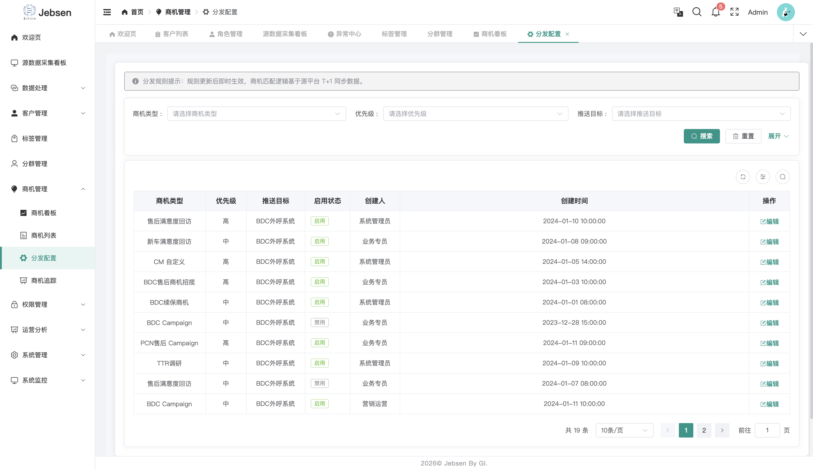
*图 29: 商机分发策略执行概览 (辅助看板)*

### 3.6 运营分析 (Operation Analysis)
为管理层提供多门店、多维度的经营分析报表。
- **业务看板 (Read)**：监控各门店的“线索转化率”、“客户留存率”及“市场渗透率”。
- **深度穿透**：点击特定门店指标，可下钻查看具体商机转化路径与流失环节。
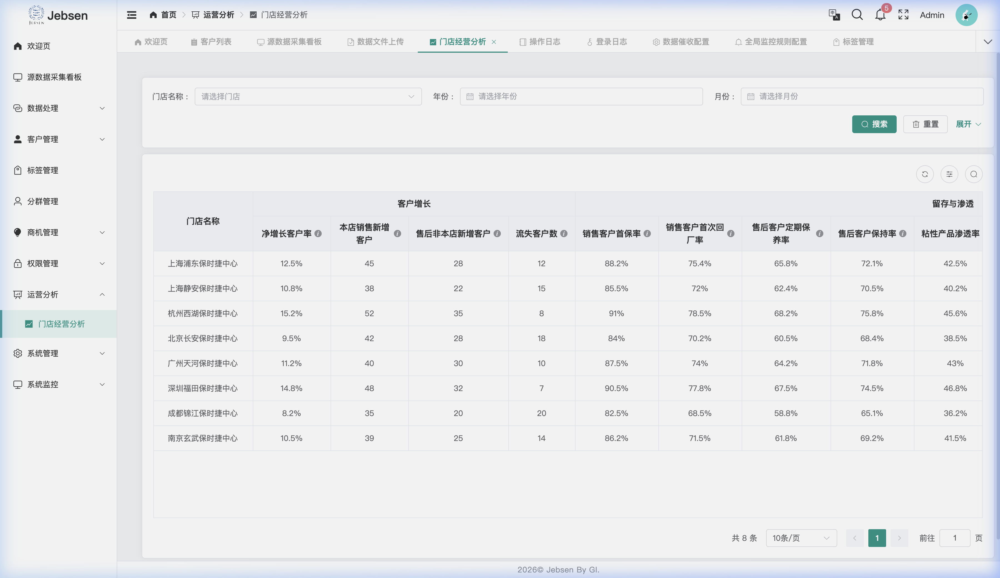
*图 30: 门店经营分析大屏*

### 3.7 系统管理与监控 (System Administration)
基于 RBAC (Role-Based Access Control) 的精细化权限配置。

#### 3.7.1 角色管理
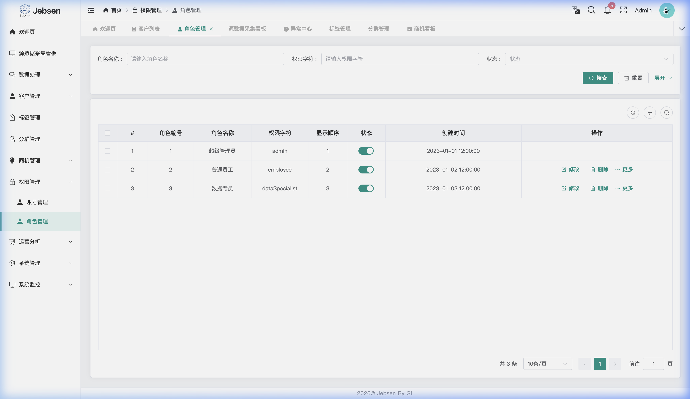
*图 31: RBAC 角色权限配置*

#### 3.7.2 操作日志审计 (Audit Logs)
记录所有用户的增删改操作，确保数据治理过程可溯源。
- **审计内容 (Read)**：包括操作时间、模块名称、操作人、原值及变更后值。
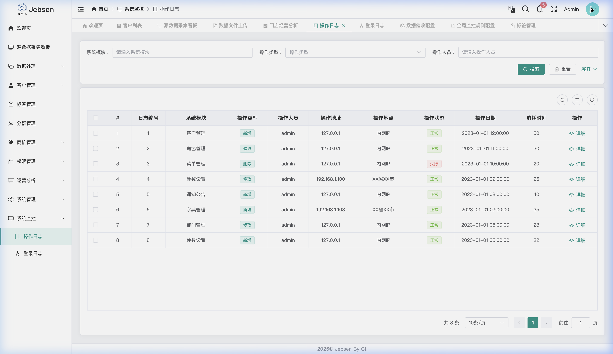
*图 32: 系统操作日志审计界面*

#### 3.7.3 全局监控规则配置 (Monitoring Rules)
设定系统级的自动化健康指标。
- **规则配置 (Update)**：配置“源数据缺失阈值”、“治理任务积压预警”等全局参数。
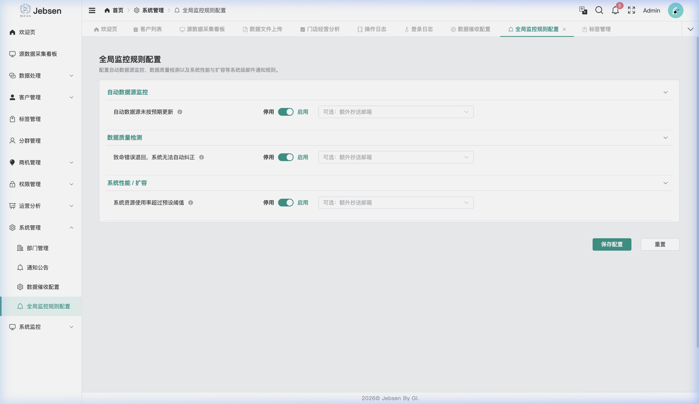
*图 33: 全局监控与质量预警规则配置*

---

## 4. H5 端功能模块 (Mobile Interface)

### 4.1 客户画像 (360 View)
H5 端为一线人员提供全方位的客户画像：
- **基本信息**：汇总 OneID 下的所有个人属性。
- **联系电话**：展示合并后的唯一号码及来源系统的原始号码。
- **车辆信息**：汇总名下所有车辆及维保情况。

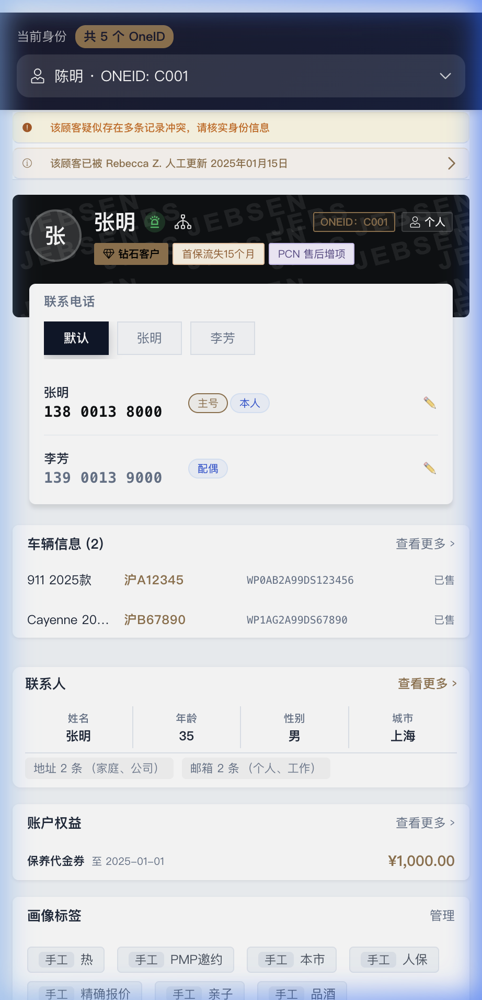
*图 34: H5 客户画像主视角*

### 4.2 核心深度交互
#### 4.2.1 身份切换与 OneID 关联
当系统中存在多个疑似同一人的 OneID 时，一线人员可以查看关联风险并进行手动切换或核对。
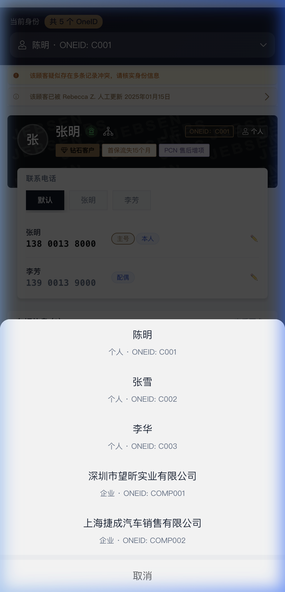
*图 35: 身份选择 ActionSheet*

#### 4.2.2 电话管理 (Phone & Label Management)
此模块支持多维度联系方式维护：
- **新增号码 (Create)**：点击“查看所有电话”->“新增号码”，录入手机号、关联人（如配偶、本人）、业务标签及备注。
- **编辑标签 (Update)**：点击号码旁的 **铅笔图标 (✏️)**，修改号码主体（Owner/Driver）、业务属性（Main Number）及标签。
- **物理删除 (Delete)**：点击非主号旁的 **垃圾桶图标 (🗑️)** 即可剔除冗余号码，系统自动保留至少一个主号。
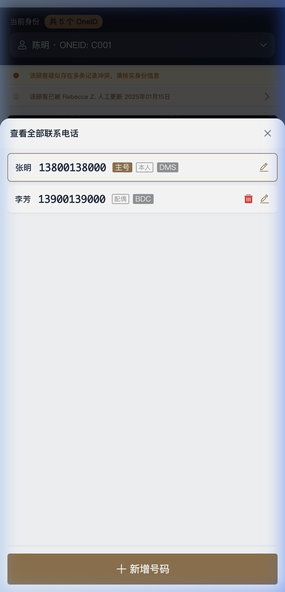
*图 36: H5 电话管理 CRUD 交互界面*

#### 4.2.3 冲突处理 (Conflict Resolver)
当系统检测到不同来源的 PII 数据冲突时（如姓名、手机），H5 端提供“冲突通知栏”。
- **确认逻辑**：一线人员可现场核实并选择“保留现有”、“采用新值”或“手动修正”，操作结果实时同步 OneID 映射表。
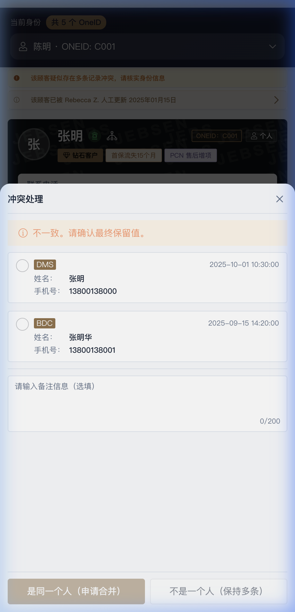
*图 37: H5 冲突合并工作流与多源比对*

#### 4.2.4 公司画像 (Enterprise Portrait)
针对 B2B 场景，提供“企业全景画像”：
- **查阅 (Read)**：查看 OneID、行业、所属门店及大客户等级。
- **权益追踪**：实时展示企业大客户礼包余额（如 ¥50,000.00）及过期时间。
- **标签维护 (Update)**：点击标签区的“管理”，为主体公司手动 **增加或移除** 业务标签（如 VIP 企业、重点潜客）。
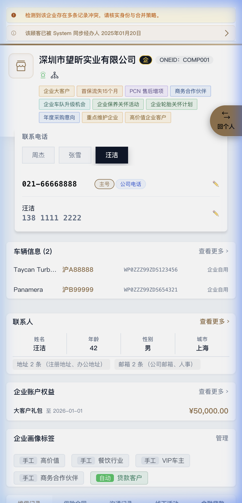
*图 38: 企业客户全景视角与 CRUD 交互看板*

---

## 5. 业务场景举例

### 场景一：销售接待与身份确认
**背景**：客户 A 来店。销售输入手机号搜索。
**过程**：
1. 系统发现客户 A 在 DMS 中有购车记录，但在 WeChat 中有活动参与记录，且两个系统登记的姓名微差（A vs A*）。
2. H5 端触发“冲突处理”，销售在现场向客户确认后，选择保留 DMS 中的正式姓名。
3. 更新后的画像同步至全局，后续 BDC 回访见到的即为核实后的正确姓名。

### 场景二：自动化标签精准营销
**背景**：运营需要在“捷成生日月”推送活动给特定车主。
**过程**：
1. PC 端在“标签管理”中设定自动规则：标签 `生日月份-次月` && `近3月有进店维保`。
2. 在“分群管理”中创建名为 `生日进店高活群体`。
3. 系统自动计算出 500 名符合要求的 OneID。
4. “商机管理”自动化分发 BDC 规则，将外呼任务推送至对应专员的系统。

---

## 6. 技术规格摘要
### 6.1 架构与部署
- **基础设施**：部署于阿里云（中国境内节点），采用 **数据湖仓 (Lakehouse)** 架构，支持大规模增量数据同步。
- **身份认证**：集成 Azure Entra ID 实现 **SSO (Single Sign-On)**，支持 OAuth + OIDC 协议。

### 6.2 前端与安全
- **技术栈**：Vue 3 + Vite + Ant Design (PC) / Vant (H5)。
- **权限模型**：基于 **RBAC (Role-Based Access Control)** 实现精细化权限配置，支持门店级数据隔离与 PII 字段脱敏。
- **安全审计**：系统 Session 刷新频率 1-4 小时，全量操作日志可审计。
