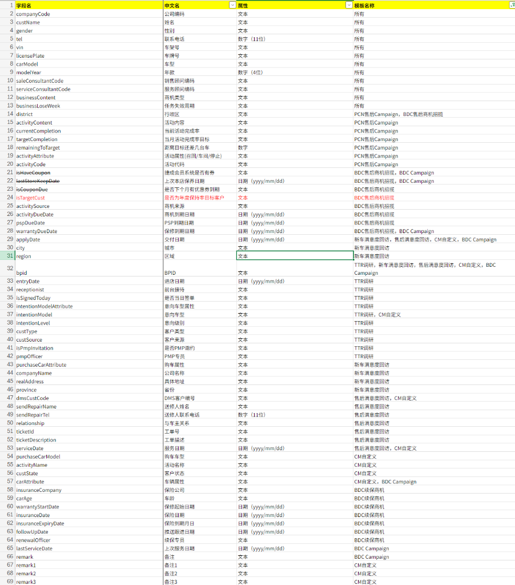

# C360 客户画像 H5 插件 — 终极细化需求确认文档 (PRD)

**文档版本**：v2.0 (全业务线最终版)  
**项目名称**：Jebsen-H5 客户画像移动端插件  
**适用对象**：客户单位、产品经理、前后端研发、QA 验收  
**更新日期**：2026-03-04  

---

## 一、 业务目标与系统边界

本系统通过移动端 H5 承载 C360 核心视图，其核心逻辑在于将分散在 **DMS (经销商管理系统)**、**POAS (潜客/商机系统)**、**WWS (保时捷工位系统)**、**C@P (销售及线索管理)**、**BDC (呼叫中心)**、**Voucher (卡券系统)**、**WeCom (企微互动)** 等各系统的离散数据，通过 **OneID 身份路由** 聚合呈现。

---

## 二、 核心业务模块全字段定义 (Data Dictionary)

### 2.1 客户核心画像 (Profile Card — Tech Detail)
| 字段名称 | 技术标识 | 数据类型 | 业务规则 / 展示逻辑 | 格式/校验规则 | 展示权重 |
| :--- | :--- | :--- | :--- | :--- | :--- |
| **OneID** | `id` | String | 全渠道唯一根标识，用于所有接口请求。 | UUID 格式 | 最高 (P0) |
| **客户姓名/身份** | `name` | Object | 展示最优值。需区分角色：**车主、送修人、联系人**。 | 2-50字符 | P0 |
| **联系人优先级** | - | - | **[逻辑]**：个人客户(Personal)优先联系车主。 | - | P0 |
| **性别** | `gender` | Enum | [1:男, 2:女, 0:未知]。识别不到显示“未知”。 | 整数枚举 | P1 |
| **年龄** | `age` | Integer | 由身份证号反查或人工录入。缺失显示“未录入”。 | 0-150 | P1 |
| **所属城市** | `city` | String | 来源为客户最后一次在 DMS 或 BDC 活跃的城市。 | 动态拉取 | P1 |
| **客户类型** | `customerType`| Enum | 决定 UI 渲染路径：`Personal` (个人), `Company` (公司)。 | 字符串枚举 | P0 |
| **分群类型** | `segmentType` | String | 由标签引擎判定的规则分群。 | 预设词库 | P1 |
| **总消费额** | `totalConsumption`| Number | 汇总该 OneID 下所有车辆与售后消费总额 (¥)。 | 取整显示 | P1 |
| **意向车型** | `preferredCarModel`| Array | 展示客户关注的最新车型及关联意向标签。 | 车型字典库 | P1 |

---

### 2.2 智能商机预警 (Smart Opportunity — Tech Detail)
基于画像大数据自动触发的高价值业务机会，支持全链路状态追踪。本模块兼容** 22 种核心业务模板**（涵盖 BDC 续保、PCN 售后、满意度回访、TTR 调研等）及**动态自定义商机**。

| 字段名称 | 技术标识 | 业务含义 / 展示逻辑 | 来源系统 | 优先级配色 | 触发阈值 |
| :--- | :--- | :--- | :--- | :--- | :--- |
| **商机 ID** | `id` | 商机全生命周期唯一标识。 | 规则引擎 | - | - |
| **商机类型** | `type` | 分类展示：[维保/代金券/流失/复购/升级]。 | 策略中心 | 高:红,中:黄,低:蓝 | 规则判定 |
| **触发规则** | `triggerRule` | 前端以 Tooltip 形式展示产生的具体逻辑依据。 | 策略中心 | - | 自定义 |
| **优先级权重** | `priority` | 枚举：[高, 中, 低]；决定前端图标背景色与排序。 | 策略中心 | - | - |
| **处理状态** | `status` | [待处理, 处理中, 已推送, 已完成, 已失效]。 | 业务中台 | 进度条显示 | 自动/人工 |
| **推送目标** | `pushTarget` | 将商机推送到具体系统：[BDC, WeCom, POAS, 销售助手]。 | 路由引擎 | - | 状态匹配 |
| **更进负责人** | `salesConsultant` | 展示当前在后端系统中挂载的具体跟进人姓名。 | 关系链路 | - | 挂载关系 |
| **推送状态** | `pushStatus` | 枚举：[待推送, 成功, 失败]；记录中台下发结果。 | 路由引擎 | - | - |
| **生成时间** | `createTime` | 系统触发判定规则并入库的精确时间。 | 系统 | - | - |
| **动态描述** | `description` | 包含：触发原因简述 + 建议操作路径。 | 算法下发 | 文本截断 | - |
| **判定系统** | `source` | 核心逻辑产生的源头标识（如：C360-Logic）。 | 系统 | - | - |
| **更新时间** | `updateTime` | 记录跟进状态或负责人变更的最近一次时间。 | 系统 | - | - |
| **ONEID 关联** | `oneId` | 对应的全渠道唯一客户身份 ID。 | MDM | - | - |

---

### 2.3 车辆全生命周期 (Vehicle Life Cycle — Full List)
记录车辆从销售线索、合同签署到售后保有全过程的精细字段。

| 字段名称 | 技术标识 | 业务含义 / 约束逻辑 | 来源系统 |
| :--- | :--- | :--- | :--- |
| **车型名称** | `vehicleModel` | 车辆完整描述（品牌+车系+排量+版本）。 | DMS |
| **车牌号** | `licensePlate` | 标准车牌格式；末上牌车辆显示 "未上牌"。 | DMS |
| **上牌城市** | `registrationCity` | 车辆实际完成上牌登记的城市。 | DMS |
| **车架号 (VIN)** | `vin` | 17位代码；默认脱敏显示（如：***123456）。 | MDM |
| **购车日期** | `purchaseDate` | 车辆交付给客户并完成系统开票的基准日期。 | DMS |
| **运营状态** | `status` | 枚举：[自用, 已售, 维修中, 订车中-在途, 异地用车]。 | 实时 |
| **数据原始来源** | `source` | 记录数据来自哪个具体系统（如 DMS, POAS 等）。 | 系统 |
| **新车车系** | `newCarSeries` | 销售合同中记录的车辆车系分类。 | C@P |
| **新车车型** | `newCarModel` | 合同中精确到的具体版本车型名。 | C@P |
| **合同编号** | `contractNo` | 对应的整车销售合同流水号。 | C@P |
| **签单状态** | `signStatus` | 销售全流程状态标记。 | C@P |
| **提交时间** | `submitTime` | 业务操作提交至审批流的时间。 | C@P |
| **签单时间** | `signTime` | 客户完成最终合规签署的时间。 | C@P |
| **交付/发放中心** | `issueCenter` | 承办交付业务的具体门店。 | C@P |
| **厂商建议售价** | `newCarMsrp` | 官方指导价（人民币元）。 | C@P |
| **最终成交价** | `newCarContractPrice`| 合同中确定的客户实付金额。 | C@P |
| **非现金折扣** | `nonCashDiscountAmount`| 包含置换补贴、金融贴息等间接折让。 | C@P |
| **附加销售项目** | `salesItemName` | 随车购买的延保、装饰、包等。 | C@P |
| **销售项目金额** | `salesItemAmount` | 对应附加项目的独立收费金额。 | C@P |

### 2.4 资产与卡券精细化 (Assets & Coupons — Full List)
覆盖所有营销权益、售后返券及购车礼包。

| 字段名称 | 技术标识 | 业务含义 / 约束逻辑 | 来源系统 |
| :--- | :--- | :--- | :--- |
| **权益 ID** | `id` | 系统自动分配的唯一权益识别号。 | Voucher |
| **资产全称** | `name` | 在前端页面显示的完整资产名称。 | Voucher |
| **资产类型** | `type` | 标识为：`coupon` (优惠券) 或 `voucher` (代金券)。 | Voucher |
| **面额** | `amount` | 代金券所具有的货币价值。 | Voucher |
| **折扣率** | `discount` | 优惠券提供的打折额度（如 0.85）。 | Voucher |
| **状态标识** | `status` | 枚举：[未使用, 已使用, 已过期]。 | 实时 |
| **有效期始** | `validFrom` | 权益生效并可开始使用的日期。 | Voucher |
| **有效期止** | `validTo` | 权益失效的具体日期。 | Voucher |
| **CommissionNo** | `commissionNo` | 关联销售佣金或批次订单的唯一码。 | 财务 |
| **绑定 VIN** | `vin` | 权益若限制车辆使用，则强制绑定此 VIN。 | 核心校验 |
| **合同号关联** | `contractNo` | 产生该权益的销售或维护合同号。 | 系统 |
| **发放中心** | `issueCenter` | 核发该资产的业务端或门店。 | 系统 |
| **父级套餐名** | `packageName` | 若属于权益礼包，展示父包名称。 | C@P |
| **资产项目金额** | `itemAmount` | 资产在系统内部对应的财务结算价值。 | 财务 |
| **项目发放源** | `itemSource` | 明确记录资产产生逻辑源头。 | 系统 |

### 2.5 金融贷款精细化 (Financial Services — Full List)
支持精准的金融衍生业务透视与到期预警。

| 字段名称 | 技术标识 | 业务含义 / 约束逻辑 | 备注 |
| :--- | :--- | :--- | :--- |
| **底层车型** | `vehicleModel` | 贷款合同所绑定的具体资产车型。 | |
| **金融签单日** | `signDate` | 客户完成金融合同签署的日期。 | |
| **签单状态** | `signStatus` | 枚举：[已签单, 未签单]。 | |
| **申请提交日** | `submitDate` | 向金融机构发起信用审查的申请日期。 | |
| **贷款开始日** | `startDate` | 合同生效及首笔发放发生的日期。 | |
| **预期剩余月数** | `expectedExpiryMonths`| 系统动态计算的距合同结束的剩余月份。 | 预警基准 |
| **还款日** | `repaymentDay` | 每月具体几号扣除当期款项（1-31）。 | |
| **还款周期** | `period` | 还款起止时间跨度展示。 | |
| **还款状态** | `status` | 枚举：[正常, 即将到期, 已结清, 逾期]。 | |
| **金融机构** | `financeInstitution`| 具体的承办银行或品牌金融公司。 | |
| **贷款周期** | `loanTerm` | 合同约定的总期数（如：36期）。 | |
| **执行费率** | `customerRate` | 最终落实给客户的实际执行贷款利率。 | |
| **贷款本金** | `loanAmount` | 合同中载明的原始借款本金金额。 | |
| **银行返点** | `bankRebate` | 银行支付给门店的佣金返点（部分角色可见）。 | 敏感字段 |
| **贷款服务费** | `loanServiceFee` | 客户向门店支付的金融服务费用。 | |
| **上牌服务费** | `vehicleRegistrationFee`| 金融打包中含有的上牌代理费。 | |
| **利率贴息** | `vehicleRegistrationCitySubsidy`| 针对政策或厂家补贴的贴息部分。 | |
| **金融折让率** | `discountRate` | 此笔金融业务为整车贡献的折让百分比。 | |
| **详细摘要** | `loanInfo` | 其他关键说明（如：弹性尾款比例等）。 | |

### 2.6 标签体系管理 (Tag System — Full List)
定义客户画像中所有自动化标签与人工标签的属性及业务规则。

| 字段名称 | 技术标识 | 业务含义 / 约束逻辑 | 备注 |
| :--- | :--- | :--- | :--- |
| **标签唯一 ID** | `id` | 标签在系统内部的唯一索引标识。 | |
| **标签名称** | `name` | 在界面上显示的文字描述（如：'高价值'）。 | |
| **所属分类** | `category` | 业务分组：[SC必选, SA必选, 续保必选, 意向级别, 爱好等]。 | 核心分组 |
| **显示颜色** | `color` | 采用莫兰迪色系（如：#A8B5C0），由系统配色方案下发。 | |
| **是否必选** | `required` | 若为 `true`，存量或新增画像必须包含此分类下的至少一项。 | 业务强制 |
| **最少选择数** | `minSelect` | 针对特定分类（如：爱好）设定最少需勾选的数量（如：≥1）。 | 业务逻辑 |
| **标签来源** | `source` | `System`: 系统自动打标；`Manual`: 人工手动打标。 | |
| **关联业务角色** | `roleLimit` | 限制仅特定角色（如：SC 或 SA）可见或可编辑的标签。 | 权限控制 |

### 2.7 业务明细页签区域 (Business Detail Tabs — Comprehensive List)
底部汇总区域通过页签切换，全量展示客户在各业务条线的历史细节。**[排序已按实物图适配]**

#### 2.7.1 维保记录 (Maintenance Records)
| 字段名称 | 技术标识 | 业务逻辑 / 展示规则 | 来源 |
| :--- | :--- | :--- | :--- |
| **服务 ID/标题** | `id` | 卡片头部的核心摘要。 | DMS |
| **服务状态** | `status` | 枚举：`已完成` (绿), `进行中` (蓝), `待处理` (黄), `已取消` (灰)。 | DMS |
| **服务类型** | `serviceType` | 保养、维修、检测、钣喷、召回等。 | DMS |
| **服务时间** | `serviceTime` | 业务结算或进店的精确时间点 (YYYY-MM-DD HH:mm:ss)。 | WWS |
| **服务门店** | `serviceStore`| 承修业务的具体 4S 店全称。 | DMS |
| **涉及车型** | `vehicleModel` | 该次维保对应的车辆型号。 | DMS |
| **服务金额** | `amount` | 红色高亮字体，保留两位小数。 | DMS |
| **分析描述** | `description` | 具体操作详情描述。 | WWS / DMS |
| **精细化标签** | `tags` | 多选标签数组：[定期保养, 质保期内, 事故维修等]。 | 系统 |

#### 2.7.2 保险合同 (Insurance Records)
| 字段名称 | 技术标识 | 业务逻辑 / 展示规则 | 来源 |
| :--- | :--- | :--- | :--- |
| **保单类型** | `type` | [交强险, 商业险, 三者责任险, 意外险]。 | DMS/POAS |
| **保费金额** | `amount` | 客户实付保费总额 (¥)。 | DMS |
| **合同状态** | `status` | [已生效, 已过期, 待续保, 已退保]。 | 系统 |
| **保险公司** | `company` | 承保的合作机构全称。 | 系统 |
| **保单号** | `policyNo` | 唯一的保险协议识别码。 | 系统 |
| **有效期(始)** | `startDate` | 保险正式生效的零点时间。 | 系统 |
| **有效期(止)** | `endDate` | 保险失效的截止日期。 | 系统 |
| **购买日期** | `purchaseDate` | 客户签署保单并缴费的日期。 | C@P |
| **续保专员** | `renewalSpecialistName`| 负责该客户续保跟进的服务人员姓名。 | DMS |
| **数据源** | `source` | 记录数据来自哪个保险采集系统。 | 系统 |

#### 2.7.3 沟通记录 (Communication Records)
| 字段名称 | 技术标识 | 业务逻辑 / 展示规则 | 来源系统 |
| :--- | :--- | :--- | :--- |
| **记录 ID** | `id` | 唯一的互动记录流水号。 | BDC / POAS |
| **沟通类别/标签** | `type` | 展示为卡片标题及类型标签：[电话沟通, 微信沟通, 现场沟通, 邮件/短信]。 | WeCom / POAS |
| **沟通时间** | `communicationTime`| 互动发生的精确时间。 | WeCom / BDC |
| **沟通人员** | `operator` | 负责接洽或操作的员工姓名。 | 系统 |
| **沟通时长** | `duration` | 通话或面谈的持续时间（如：15分钟）。 | BDC |
| **核心内容** | `content` | 详细的交谈纪要或咨询问题摘要。 | 系统 |
| **沟通结果** | `result` | 最终结论：[已预约, 已解决, 待跟进]。 | POAS |
| **备注信息** | `notes` | 销售或客服录入的额外补充信息。 | 系统 |

#### 2.7.4 线下活动记录 (Marketing Campaigns)
| 字段名称 | 技术标识 | 业务含义 / 展示规则 | 来源系统 |
| :--- | :--- | :--- | :--- |
| **活动名称** | `campaignName` | 客户报名的线下营销/品牌活动全称。 | POAS |
| **活动编码** | `campaignCode` | 营销系统生成的活动唯一 ID。 | POAS |
| **活动类型** | `campaignType` | [试驾活动, 新车发布会, 车主聚会, 品牌体验日等]。 | POAS |
| **活动时间** | `activityTime` | 活动举办的具体时段。 | POAS |
| **参与状态** | `status` | 枚举：`已参加` (绿), `未参加` (黄)。 | POAS |
| **举办地点** | `location` | 活动发生的物理地址或门店。 | POAS |
| **组织者** | `organizer` | 活动的负责部门 or 门店。 | POAS |
| **上传/录入人** | `uploader` | 将客户参与信息录入系统的人员。 | POAS |
| **有效例子** | `validExamples` | 此活动贡献的有效线索数量（内部参考）。 | POAS |
| **活动描述** | `description` | 活动的背景或优惠政策说明。 | POAS |

#### 2.7.5 金融贷款明细 (Financial Loan Details)
| 字段名称 | 技术标识 | 业务含义 / 展示逻辑 | 来源系统 |
| :--- | :--- | :--- | :--- |
| **车辆信息** | `vehicleModel` | 贷款关联的车型名称（卡片标题）。 | C@P |
| **分期状态** | `status` | 枚举：`正常` (绿), `即将到期` (黄), `已结清` (蓝), `逾期` (红)。 | C@P |
| **执行状态** | `signStatus` | 合同层面：[已签单, 未签单]。 | C@P |
| **提交日期** | `submitDate` | 向金融机构发起进件申请的时间。 | C@P |
| **签单日期** | `signDate` | 金融合同完成签署的时间。 | C@P |
| **金融机构** | `financeInstitution`| 具体的贷款银行或合作小贷公司名称。 | C@P |
| **贷款周期** | `loanTerm` | 展期月数，如：`36期`, `24期`。 | C@P |
| **客户费率** | `customerRate` | 实际年化利率（%）。 | C@P |
| **发放中心** | `issueCenter` | 承办此笔贷款的业务门店。 | C@P |
| **关键金额** | `loanAmount` | 包含：`贷款金额`, `银行返点`, `贷款服务费` (¥)。 | C@P |
| **其他费用** | `secondaryFees` | 包含：`上牌服务费`, `利息补贴`, `折扣率` (%)。 | C@P |
| **详细摘要** | `loanInfo` | 核心摘要描述信息。 | C@P |

---

### 2.8 公司账户经办人管理 (B-Side Handler Management)
针对公司账户，需独立维护多位联系人信息。

| 字段名称 | 技术标识 | 说明 | 联动性 |
| :--- | :--- | :--- | :--- |
| **经办人姓名** | `name` | 公司内部具体负责维保/行政的人员。 | - |
| **身份角色** | `role` | 涵盖：**车主、送修人、联系人**。 | - |
| **联系电话** | `mobile` | 该经办人的直接联系方式。 | 纯文本展示，不支持拨打 |
| **展示优先级** | - | **[逻辑]**：优先显示送修人/联系人，车主排序最后。 | - |

### 2.9 最新操作日志与溯源 (Latest Ops & Traceability)
记录该 OneID 的全路径合并与变更过程。

| 字段名称 | 技术标识 | 业务含义 |
| :--- | :--- | :--- |
| **操作人/时间** | `operator` / `operationTime` | 精确记录谁在何时做了最后一次改动。 |
| **动作类型** | `operationType` | [人工纠偏, 系统合并, 线索接入]。 | WeCom |
| **平台溯源树** | `platformSources` | 展示 OneID 是由哪些原始平台（DMS_SH, POAS_SZ 等）在何时合并而来。 | MDM |
| **变更详情** | `details` | 字段 A 的旧值 `oldValue` 与新值 `newValue` 的对比镜像。 |

---

## 三、 功能核心逻辑描述 (Functional Description)

待后端提供
---

## 四、 核心 User Story (用户故事场景)

待后端提供
---

## 五、 非功能性约束与性能规范

待后端提供
---

## 六、 签字确认

| 角色 | 单位/部门 | 负责人签名 | 日期 |
| :--- | :--- | :--- | :--- |
| **业务确认方** | 客户单位-业务部 | | 2026/03/04 |
| **技术验收方** | 客户单位-IT部 | | 2026/03/04 |
| **承建交付方** | Jebsen-H5 项目组 | | 2026/03/04 |
